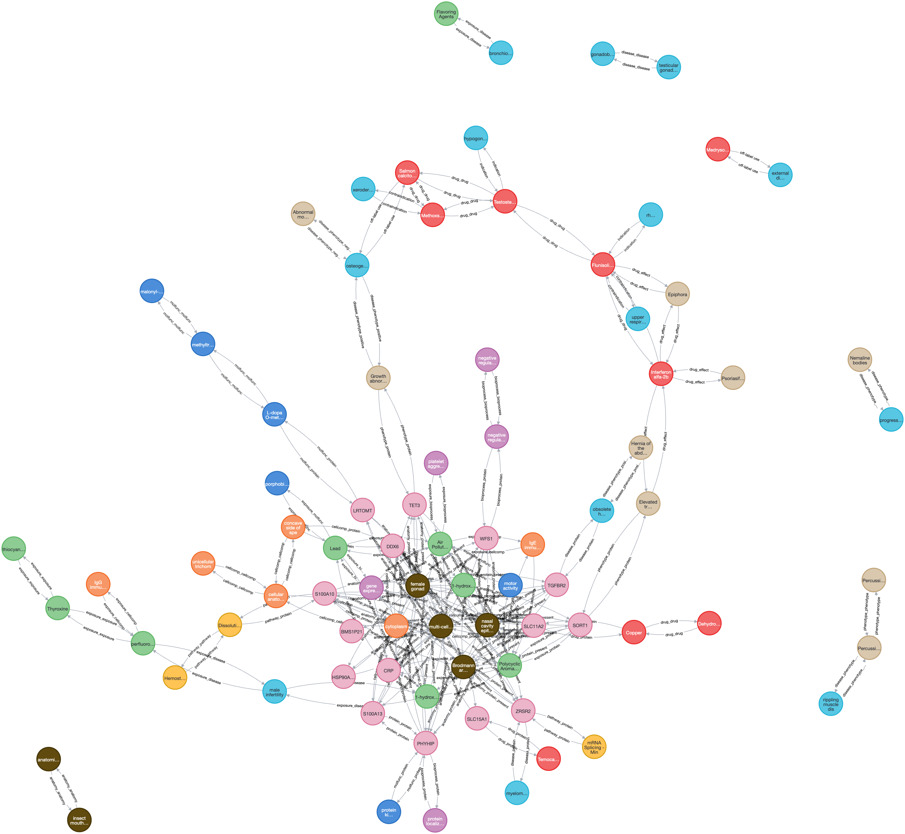

# Neo4j KGs



    Neo4jLoader - INFO - === PrimeKG Final Database Statistics ===
    Neo4jLoader - INFO - Total nodes: 129375
    Neo4jLoader - INFO - Total relationships: 8100498

## Overview
The goal of this repository is to provide the scripts and data downloads required to load popular KGs in Neo4j. This project currently supports three knowledge graphs:
1. SemMedDB (Semantic MEDLINE Database) - Processing biomedical semantic predications from PubMed literature. 
2. PrimeKG - A comprehensive, high-quality biomedical knowledge graph containing diseases and biological scales.
3. iKraph - A comprehensive biomedical knowledge graph integrating PubMed literature and external database relationships. 

## Data Downloads
Download the pre-processed data files from our Box folders:

- **SemMedDB**: [Download from Box](https://uofi.box.com/s/fz67gvfri2iopunh71dn4vamigx08k9k)
- **PrimeKG**: [Download from Box](https://uofi.box.com/s/uw7sppna81lqvmlr5s6clht438ityf0i)
- **iKraph**: [Download from Box](https://uofi.box.com/s/d2b2wdnm3vg54fa24wx0tj3yjt9dw8h6)

## Features
- Automated data loading via shell scripts and pre-processed CSV files
- Docker containerization for easy deployment
- Support for large-scale knowledge graphs
- Optimized import process for Neo4j

## Prerequisites
- Docker and Docker Compose
- Neo4j APOC plugin (automatically installed via Docker)

## Available Knowledge Graphs

### PrimeKG
PrimeKG is currently available and ready for import. To use PrimeKG:

1. Download the pre-processed CSV files from our Box folder. 
2. Place the files in the `data/` directory:
   ```
   data/
   ├── unique_nodes.csv
   └── unique_edges.csv
   ```
3. Run the import script (see Installation section)

### SemMedDB
SemMedDB is currently available and ready for import. To use SemMedDB:

1. Download the pre-processed CSV files from our Box folder
2. Place the files in the `data/` directory:
   ```
   data/
   ├── concept.csv.gz
   ├── concept_header.csv
   ├── predication.csv.gz
   ├── predication_header.csv
   ├── connections.csv.gz
   ├── connections_header.csv
   ├── connections_1.csv.gz
   ├── connections_2.csv.gz
   ├── sentence.csv.gz
   ├── sentences_header.csv
   ├── citations.csv.gz
   └── citations_header.csv
   ```
3. Run the import script (see Installation section)

The SemMedDB knowledge graph contains semantic predications extracted from biomedical literature, including:
- Medical concepts (diseases, drugs, procedures, etc.)
- Semantic relationships between concepts
- Citations linking to source literature
- Sentence-level context for each predication

### iKraph
iKraph is currently available and ready for import. To use iKraph:

1. Download the compressed CSV files from our Box folder
2. Place the files in the `iKraph/import/` directory:
   ```
   iKraph/import/
   ├── nodes_*.csv.gz        # 12 node files
   └── relationships_*.csv.gz # 2 relationship files
   ```
3. Run the import script:
   ```bash
   cd iKraph
   ./docker_import.sh  # For Docker method
   ```

The iKraph knowledge graph integrates biomedical data from multiple sources, including:
- Biomedical entities (genes, diseases, chemicals, etc.)
- PubMed literature relationships with scores and probabilities
- External database relationships with source information
- Rich metadata for entity identification and classification

**For detailed iKraph documentation, see [iKraph/README_IMPORT.md](iKraph/README_IMPORT.md)**

## Installation
1. Clone the repository:
```bash
git clone https://github.com/drshika/neo4j-exploration.git
```

2. Download the required data files and place them in the appropriate directories

3. Run the import script to load the data into Neo4j:
```bash
./import_data.sh
```

4. Access the Neo4j browser at http://localhost:7474/browser/

## Data Model
The graph database structure varies by knowledge graph:

### PrimeKG
- Nodes represent biomedical entities (genes, diseases, drugs, etc.)
- Edges represent relationships between these entities
- Detailed schema information is available in the PrimeKG documentation

## Acknowledgments
- National Library of Medicine (NLM)
- PrimeKG development team
- Neo4j community

## Contact
For questions and support, please open an issue in the repository.

## References
- [SemMedDB Documentation](https://lhncbc.nlm.nih.gov/ii/tools/SemRep_SemMedDB_SKR/dbinfo.html)
- [PrimeKG](https://github.com/mims-harvard/PrimeKG)
- [Neo4j Documentation](https://neo4j.com/docs/)

## Changelog
See [changelog.md](changelog.md) for detailed project history and updates.